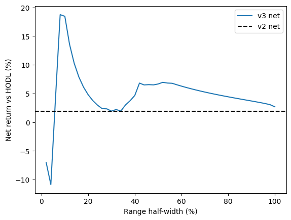

# Impermanent Loss & Uniswap v2 vs v3 LP Returns

A parameterized impermanent loss (IL) calculator for Uniswap v2 and v3, plus a 90-day empirical comparison of LP returns on the ETH/USDC 0.05% pool using real fee, TVL and price data.

**Live calculator:** [add link after the web calculator is built]
**Dune query (daily volume and fees):** https://dune.com/queries/8923955

## What's in this repo

| File | Description |
|---|---|
| `il_calculator.py` | IL functions for v2 (constant product) and v3 (concentrated liquidity), liquidity multiplier, v2 vs v3 comparison |
| `il_calculator.ipynb` | Colab notebook: derivations, plots, real-data analysis |
| `charts/` | TVL and fee APY, IL curves, net return plots, range-width sweep |

## The math

**Uniswap v2 (x·y = k).** With r = P_new / P_old, the pool holds √(k/P) of the base token and √(kP) of the quote token, so LP value is 2√(kP). Dividing by HODL value gives:

IL = 2√r / (1 + r) − 1

A 2x price move costs about 5.7% and a 4x move about 20%, and IL is symmetric for r and 1/r.

**Uniswap v3 (concentrated liquidity).** For a range [pa, pb] and liquidity L, at price p inside the range:

- base token = L(1/√p − 1/√pb)
- quote token = L(√p − √pa)

Outside the range the position is 100% one asset. The same capital provides a **liquidity multiplier** more liquidity than full-range v2, so it earns proportionally more fees while in range, and IL is amplified by the same effect.

## Empirical analysis (ETH/USDC 0.05%, 90 days to October 2026)

Data: fees and volume from Dune, TVL and fee APY from DeFiLlama, ETH prices from DeFiLlama coins API.

| Strategy | Liquidity multiplier | Days in range | Fees | IL | Net vs HODL |
|---|---|---|---|---|---|
| v2 full range | 1x | 100% | 3.3% | -1.3% | +2.0% |
| v3 ±5% | 40.5x | 18% | 21.5% | -15.0% | +6.5% |
| v3 ±20% | 10.4x | 42% | 16.5% | -11.4% | +5.2% |
| v3 ±50% | 4.2x | 91% | 13.3% | -5.9% | +7.4% |

**Takeaway:** narrower ranges earn much more per day in range, but they spend more time out of range and carry more IL. In this window the widest tested range (±50%) delivered the best net result. The break-even depends on expected fee income relative to expected price movement.



## Limitations

- v3 fees are scaled from the pool's average fee yield using the liquidity multiplier. The pool's TVL is already partly concentrated, so this likely overstates v3 fees; treat v3 fee figures as upper bounds.
- Positions are static (no rebalancing) and centered on the start price.
- IL is measured at the end price only; path-dependent effects are not modeled.
- One 90-day sample; results will differ for other price paths.

## Usage

```python
from il_calculator import il_v2, il_v3, liquidity_multiplier

il_v2(2.0)                              # -0.0572
il_v3(2000, 2400, 1800, 2600)           # IL for a v3 range
liquidity_multiplier(2000, 1800, 2600)  # concentration vs full range
```

## Author

[@sekaniseyi](https://x.com/sekaniseyi)
