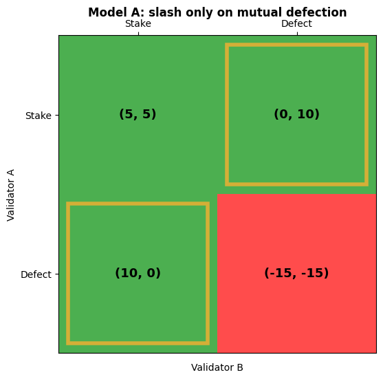
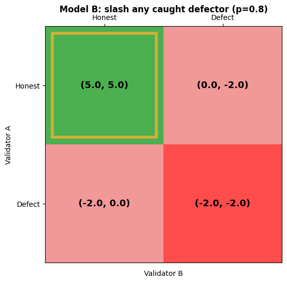
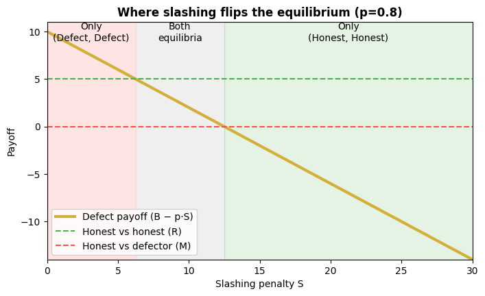

# Validator Game Simulator

[](https://colab.research.google.com/github/SekaniDev/te-portfolio/blob/main/validator-game-simulator/validator_game_simulator.ipynb)

A game theory simulator for Proof-of-Stake security. Two validators each choose whether to act honestly or defect (equivocate, extract malicious MEV, or collude). The simulator finds the Nash equilibria, shows how the slashing penalty changes them, and visualizes the payoff matrix.

## The question

Does a larger slashing penalty make honest validation the equilibrium? The answer depends on **where the penalty applies**, so the notebook compares two models.

## Parameters

| Symbol | Meaning | Value used |
|---|---|---|
| R | Reward for honest validation | 5 |
| B | Bribe / MEV from defecting | 10 |
| M | Payoff for staking honestly while the other defects | 0 |
| S | Slashing penalty (positive magnitude) | 15 |
| p | Probability a defector is caught (Model B only) | 0.8 |

## Model A: slash only when both validators defect

| | B: Stake | B: Defect |
|---|---|---|
| **A: Stake** | (5, 5) | (0, 10) |
| **A: Defect** | (10, 0) | (-15, -15) |

Because B > R, each validator wants to defect against an honest one, but staking beats defecting against a defector. This is a game of **Chicken**, with three equilibria:

- (Stake, Defect) and (Defect, Stake)
- A mixed equilibrium where each validator stakes with probability S / (S + B - R) = 75%



Raising S makes validators stake more often in the mixed equilibrium, but never removes the lone-defector equilibria:

| S | Equilibria | Mixed Stake probability |
|---|---|---|
| 5 | 3 | 50% |
| 15 | 3 | 75% |
| 45 | 3 | 90% |
| 150 | 3 | 97% |

**Interpretation:** S here works as a systemic cost (network halt or collapse) that only appears when everyone defects. It is not a penalty applied by the protocol to an individual validator.

## Model B: slash any caught defector

A defector is slashed with probability p whatever the other validator does, so a defector's expected payoff is **B - p·S** in both Defect cells. With S = 15 and p = 0.8 that is -2.

| | B: Honest | B: Defect |
|---|---|---|
| **A: Honest** | (5, 5) | (0, -2) |
| **A: Defect** | (-2, 0) | (-2, -2) |

(Honest, Honest) is the only equilibrium.



### Two thresholds

Sweeping S shows the equilibrium changes in stages:

| Slashing penalty | Condition | Equilibria |
|---|---|---|
| S < 6.25 | p·S < B - R | Only (Defect, Defect) |
| 6.25 < S < 12.5 | B - R < p·S < B - M | Both (Honest, Honest) and (Defect, Defect) |
| S > 12.5 | p·S > B - M | Only (Honest, Honest) |

Honesty becomes *possible* once p·S exceeds B - R, and *guaranteed* once p·S exceeds B - M.



## Run it

Click the Colab badge above, or open `validator_game_simulator.ipynb` in Jupyter. Requirements:

```
numpy
nashpy
matplotlib
```

In Colab, the first cell installs nashpy with `!pip install nashpy -q`.

## Method

- **Pure equilibria:** checked directly. A cell is an equilibrium if neither player gains by switching alone.
- **Mixed equilibria:** solved with `nashpy` using support enumeration.
- **Heatmap:** each cell shows both payoffs and is colored by total welfare. Gold boxes mark pure equilibria.

## Limitations

- Two validators is a toy model. Real security depends on the fraction of stake that is faulty, not on pairwise play.
- The game is one-shot. Repeated-game effects, such as losing future rewards, are not modeled.
- Mixed-strategy probabilities describe these payoffs, not how often real validators defect.
- Model B assumes a fixed detection probability. Real protocols can only slash offences that are provable.
